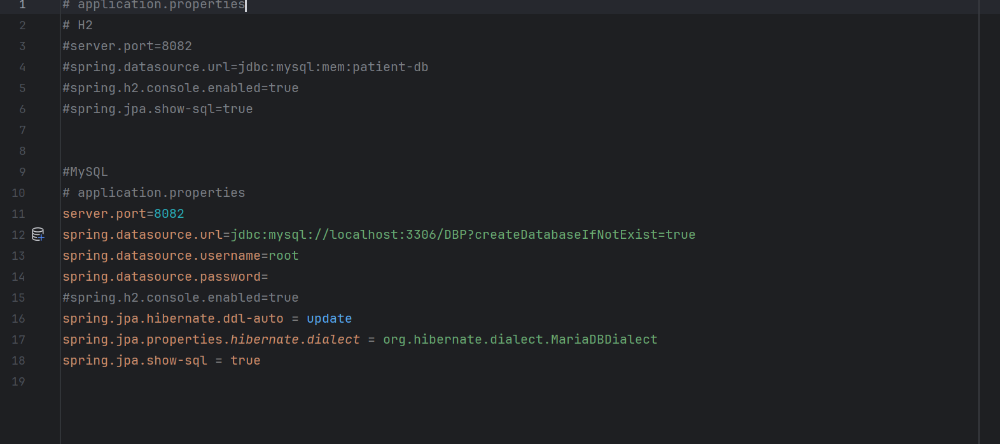

<h1 style="text-align: center;"> Compte rendue</h1>

<h2>Introduction</h2>

Le développement d'applications basées sur Java est devenu une norme dans l'industrie logicielle, offrant une robustesse et une flexibilité essentielles pour répondre aux besoins des entreprises modernes. Dans ce contexte, les frameworks de développement comme Spring Boot ont gagné en popularité en raison de leur capacité à simplifier le processus de développement et à fournir une architecture solide pour les applications Java.   
L'objectif de ce rapport est de démontrer la mise en œuvre d'une application de gestion de patients en utilisant Spring Boot, un framework Java bien connu pour le développement d'applications web. Cette application permet la gestion complète des patients, y compris l'ajout, la consultation, la mise à jour et la suppression de patients à partir d'une base de données.

   
Dans ce projet, nous allons suivre plusieurs étapes clés :

<ul>
<li><b>Création du projet Spring Initializr : </b>Nous allons configurer un projet Spring Boot en utilisant l'interface web Spring Initializr et sélectionner les dépendances appropriées, notamment JPA, H2, Spring Web, et Lombok.</li> 
<li><b>Création du projet Spring Initializr : </b>Nous allons configurer un projet Spring Boot en utilisant l'interface web Spring Initializr et sélectionner les dépendances appropriées, notamment JPA, H2, Spring Web, et Lombok.
</li>
<li><b>Configuration de l'unité de persistance :</b> Nous configurerons l'unité de persistance dans le fichier application.properties pour utiliser une base de données H2 en mémoire pour la simplicité de développement.</li>

<li><b>Création de l'interface JPA Repository :</b> Nous créerons une interface JPA Repository pour l'entité Patient, qui nous permettra d'effectuer des opérations CRUD (Create, Read, Update, Delete) sur les patients.</li>

<li><b>Implémentation des opérations de gestion des patients :</b> Nous créerons un service ou un contrôleur Spring qui utilisera le PatientRepository pour réaliser différentes opérations sur les patients, telles que l'ajout, la consultation, la mise à jour et la suppression.</li>
<li><b>Migration de la base de données H2 vers MySQL :</b> Nous aborderons également la migration de la base de données H2 utilisée pour le développement vers une base de données MySQL, une solution plus adaptée pour les environnements de production.</li>
</ul>
  
À travers ces étapes, nous illustrerons l'usage de Spring Boot dans le développement d'applications web robustes et extensibles, tout en mettant en avant les bonnes pratiques de développement Java et la gestion efficace des données.

 
<h2>Énoncé</h2>

1- Installer IntelliJ Ultimate

2- Créer un projet Spring Initializer avec les dépendances JPA, H2, Spring Web et Lombok

3- Créer l'entité JPA Patient ayant les attributs :

<ul>
  <li>id de type Long</li>
  <li>nom de type String</li>
  <li>date de naissance de type Date</li>
  <li>malade de type boolean</li>
  <li>score de type int</li>
</ul>

4- Configurer l'unité de persistance dans le fichier application.properties

5- Créer l'interface JPA Repository basée sur Spring Data

6- Tester quelques opérations de gestion :

<ul>
  <li>Ajouter des patients</li>
  <li>Consulter tous les patients</li>
  <li>Chercher un patient par Id</li>
  <li>Mettre à jour un patient</li>
  <li>Supprimer un patient</li>
</ul>

7- Migrer de H2 Database vers MySQL

<h2>Réalisation</h2>

1- <b>Créer un projet Spring Initializer </b>  
2- <b>Création de l'Entité JPA Patient : </b>   

  

3- <b>Configurer l'unité de persistance dans le fichier application.properties :</b> avec H2 puis migrer vers MySQL.  

  
4- <b> Créer l'interface JPA Repository :</b>   
   

5- <b>Tester quelques opérations de gestion de patients :</b>   
   

   
   

   
6- <b>Migrer de H2 Database vers MySQL :</b>  
Configurez application.properties avec les détails de connexion MySQL.

<h2>Conclusion</h2>

En conclusion, ce projet a démontré que Spring Boot est une solution puissante et polyvalente pour le développement d'applications web Java, offrant à la fois simplicité et performance pour répondre aux besoins des entreprises modernes.

